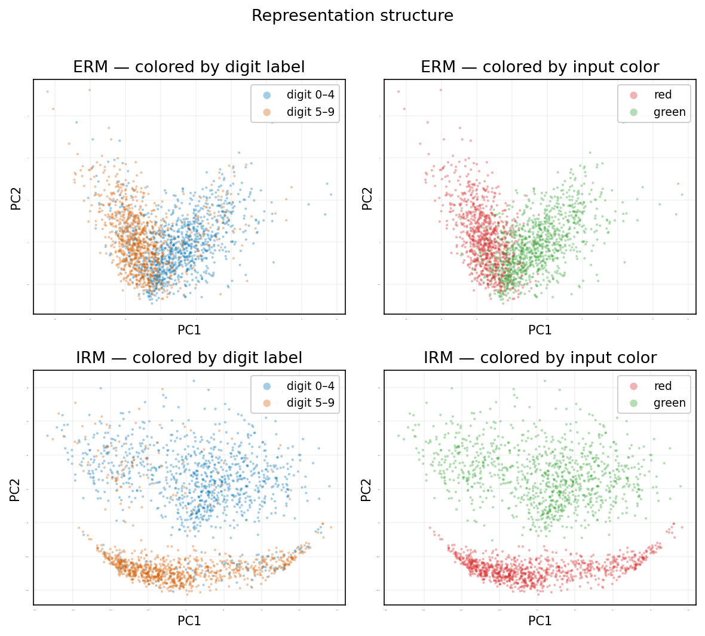

<div align="center">

# Invariant Risk Minimization on Colored MNIST

> *An empirical reproduction of [Invariant Risk Minimization (IRM)](https://arxiv.org/abs/1907.02893) and representation analysis of out-of-distribution generalization.*

[](https://colab.research.google.com/drive/12_yHp6XynY7E3vlwdlTnastwfLiklRNY?usp=sharing)

</div>

---

<div align="center">

  

  **Figure 1:** ERM memorizes the spurious color shortcut and collapses to $29.4\%$ test accuracy. IRM recovers to $66.2\%$ by penalizing features that shift across environments.
</div>

## 1. Introduction

This repository reproduces the core [Colored MNIST](https://arxiv.org/abs/1907.02893) experiments from [Arjovsky et al. (2019)](https://arxiv.org/abs/1907.02893) and extends them with linear representation probing. Colored MNIST is a synthetic benchmark that tests out-of-distribution generalization by injecting a spurious color feature that strongly correlates with the label during training but anti-correlates at test time. While Empirical Risk Minimization (ERM) exploits this shortcut and fails on the test set, Invariant Risk Minimization (IRM) learns the underlying causal shape features.

## 2. Usage

### 2.1 Installation

```bash
git clone https://github.com/ahmadrazacdx/colored-mnist-irm.git
cd colored-mnist-irm
pip install -r requirements.txt
```

### 2.2 Dataset Generation

```bash
python data.py
```

### 2.3 Training

Use `train.py` to train the models. The script supports both ERM and IRM methods. It accepts the following flags:

<div align="center" markdown="1">

| Flag | Requirement | Description | Default |
| --- | --- | --- | --- |
| `--mode` | `required` | Algorithm to use. Choices: `erm` or `irm`. | - |
| `--steps` | `optional` | Total number of training steps. | `500` |
| `--lr` | `optional` | Learning rate. | `1e-3` |
| `--penalty_weight` | `optional` | IRM penalty weight. | `1e4` |
| `--anneal_steps` | `optional` | Warmup steps before applying the IRM penalty. | `190` |

</div>

```bash
# Train using Empirical Risk Minimization (ERM)
python train.py --mode erm

# Train using Invariant Risk Minimization (IRM)
python train.py --mode irm
```

### 2.4 Probing

Extracts the frozen features from the trained models encoder and fits logistic regression probes to classify the causal or spurious features.

```bash
python probe.py
```

## 3. Dataset

Binary MNIST (digits $0-4$: class $0$, digits $5-9$: class $1$) with $25\%$ label noise. Each digit is colored red or green, where color correlates with the noisy label at different strengths per environment:

<div align="center" markdown="1">

| Environment | Samples | Color–Label Correlation |
| --- | --- | --- |
| $Env_{tr_1} \; (\text{train})$ | $25,000$ | $90.1\%$ |
| $Env_{tr_2} \; (\text{train})$ | $25,000$ | $79.9\%$ |
| $Env_{test} \; (\text{test})$ | $10,000$ | $9.9\% \; (\text{reversed})$ |

</div>

<div align="center">

  

  **Figure 2:** Sample environments demonstrating the varying color-label correlation.
</div>

The $25\%$ label noise is important, it caps the Bayes-optimal accuracy at $75\%$ even for a perfect shape-based classifier. This prevents trivial solutions and makes the spurious shortcut (color at $\sim 85\%$ pooled correlation) genuinely tempting for the optimizer.

## 4. Architecture

$2$-hidden-layer MLP with $390$ units each (ReLU activations), matching the original IRM paper. Input is a $2$-channel $14 \times 14$ image (downsampled MNIST, one channel per color). Output is a single logit for binary classification. The network is split into an `encoder` (hidden layers) and a `head` (final linear layer), this split is built so we can extract frozen features for probing later without modifying anything.

## 5. Experiments

Both methods are trained over $3$ random seeds. The tables below report the mean and standard deviation.

### 5.1 OOD Generalization

**ERM** pools all training data and minimizes cross-entropy. It has no mechanism to detect which features are spurious, it simply follows the strongest gradient signal, which is color.

**IRM** adds a per-environment penalty: for each environment, it checks whether scaling the logits by a dummy scalar $w=1.0$ is already optimal. If the gradient of the loss with respect to this scalar is non-zero, it means the representation encodes something environment-specific. Penalizing the squared norm of this gradient forces the model to find features where a single classifier works everywhere. The penalty is activated after $190$ warmup steps of pure ERM.

<div align="center" markdown="1">

| Method | $Env_1$ | $Env_2$ | Test |
| --- | --- | --- | --- |
| **ERM** | $97.6\% \pm 0.4\%$ | $96.1\% \pm 0.3\%$ | **$29.4\% \pm 1.8\%$** |
| **IRM** | $73.0\% \pm 1.2\%$ | $72.8\% \pm 1.1\%$ | **$66.2\% \pm 0.1\%$** |

</div>
ERM achieves near-perfect training accuracy by exploiting color. This backfires at test time where color is anti-correlated with the label, and the model is confidently wrong. IRM sacrifices $\sim25$ points of training accuracy but gains genuine out-of-distribution generalization, approaching the $75\%$ shape-only ceiling. The standard deviation on IRM's test accuracy is just $0.1\%$, meaning the result is highly stable across seeds.

### 5.2 Training Dynamics

<div align="center" markdown="1">

  

  **Figure 3:** Training dynamics of ERM and IRM showing the effect of the invariance penalty.
</div>

The phase transition at step $190$ is the most informative part of this experiment. During warmup (steps $1–190$), IRM behaves identically to ERM, both latch onto color, and test accuracy declines. The moment the invariance penalty activates, IRM's test accuracy reverses direction and climbs sharply while its training accuracy drops. This is the trade-off at work: the model is abandoning a feature that helps on the training distribution but hurts on the test distribution.

### 5.3 Representation Analysis

We extract the $390$-dimensional features from the penultimate layer of both trained models and fit logistic regression probes to classify either the spurious feature (color) or the causal feature (digit class).

<div align="center" markdown="1">

| Probe Target | ERM Features | IRM Features |
| --- | --- | --- |
| **Color** (spurious) | $100.0\% \pm 0.0\%$ | $100.0\% \pm 0.0\%$ |
| **Digit** (causal) | $85.6\% \pm 0.3\%$ | $74.3\% \pm 0.1\%$ |

</div>

<div align="center">

  

  **Figure 4:** Representation probing results for ERM and IRM features.
</div>

Both representations retain perfect color information, a linear probe decodes color at $100\%$ from both ERM and IRM features. This is expected and worth discussing: IRM-v1 is a **predictor alignment** method, not an information bottleneck. It makes the classifier head ignore color, but it doesn't force the representation to erase it. The color information is still present in the $390$-dimensional space, it's just orthogonal to the prediction direction. A method like DANN (domain-adversarial training) would actively try to remove color from the representation, which is a fundamentally different approach.

The digit probe confirms that IRM's representation retains causal shape information ($74.3\%$), closely matching its actual test accuracy. ERM's digit probe is higher ($85.6\%$) because its representation encodes everything aggressively, both color and shape, but it uses the wrong one at test time.

### 5.4 Representation Geometry

The probing results show both representations encode color perfectly — so why does ERM fail and IRM succeed? The answer lies in the **classifier head**, not the representation. Both models have 390-dimensional feature spaces with color and digit encoded along orthogonal directions. The difference is which direction the head points.

We measure this by computing $|\cos(\hat{w}_{head},\, \hat{w}_{color})|$ and $|\cos(\hat{w}_{head},\, \hat{w}_{digit})|$, where $\hat{w}_{head}$ is the head's weight vector and $\hat{w}_{color}$, $\hat{w}_{digit}$ are the probe directions.

<div align="center">

  

  **Figure 5:** Classifier head alignment. We compute the cosine similarity between the model's head weight vector and the linear probe directions for color and digit. ERM's head aligns strongly with the color direction, while IRM's head aligns strictly with the digit direction.
</div>

ERM's head aligns with the color probe direction — it classifies by color. IRM's head aligns with the digit probe direction — it classifies by shape. The representation geometry is similar in both models (both encode color and digit along separate directions), but IRM's penalty rotated the head away from the spurious feature and toward the causal one. This is precisely what "predictor alignment" means: IRM doesn't erase color from the representation, it makes the classifier ignore it.

## 6. Discussion

- **IRM Stability:** IRM-v1 was remarkably stable here (test std = $0.1\%$). This is not always the case. [Gulrajani & Lopez-Paz (2021)](https://arxiv.org/abs/2007.01434) showed that IRM can be highly sensitive to hyperparameters on more complex benchmarks like DomainBed. The stability we observe is partly due to the simplicity of Colored MNIST.
- **Gap from Shape Ceiling:** IRM reaches $\sim 66.2\%$ vs the theoretical $75\%$ ceiling. This gap comes from the interaction between $25\%$ label noise and IRM's optimization dynamics. Longer training, learning rate tuning, or stronger penalty weights could close it.
- **The $100\%$ Color Probe:** IRM's representation perfectly encodes color while ignoring it for prediction. The PCA visualization (Figure 5) confirms this mechanistically: color is not erased, it is rotated orthogonal to the prediction axis. Methods like DANN that enforce a domain-adversarial loss would actively erase color from the representation, which is a fundamentally different approach.

## 7. References

- Arjovsky, M., Bottou, L., Gulrajani, I., & Lopez-Paz, D. (2019). *Invariant Risk Minimization.* [arXiv:1907.02893](https://arxiv.org/abs/1907.02893)
- Gulrajani, I., & Lopez-Paz, D. (2021). *In Search of Lost Domain Generalization.* ICLR 2021. [arXiv:2007.01434](https://arxiv.org/abs/2007.01434)
