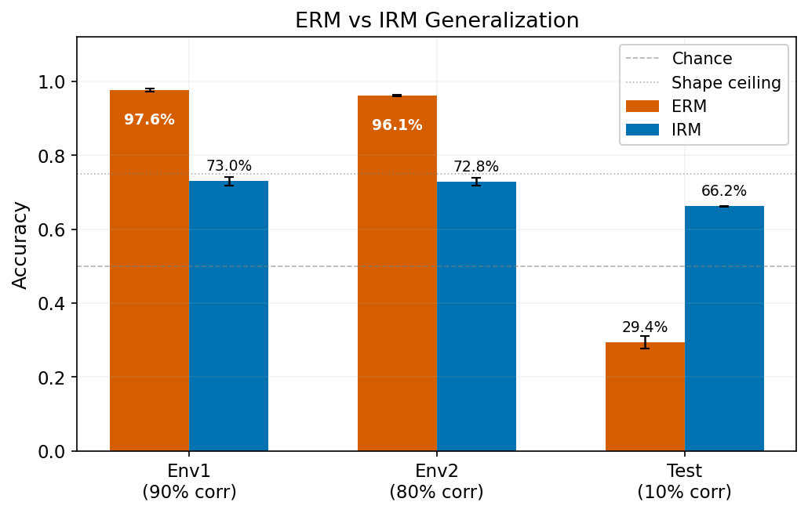
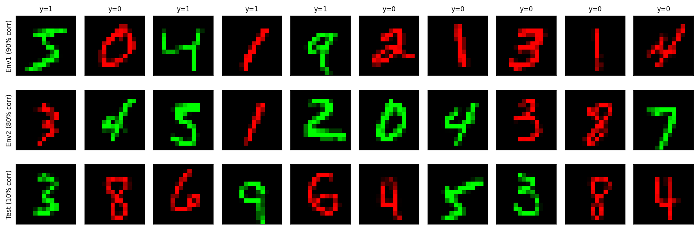
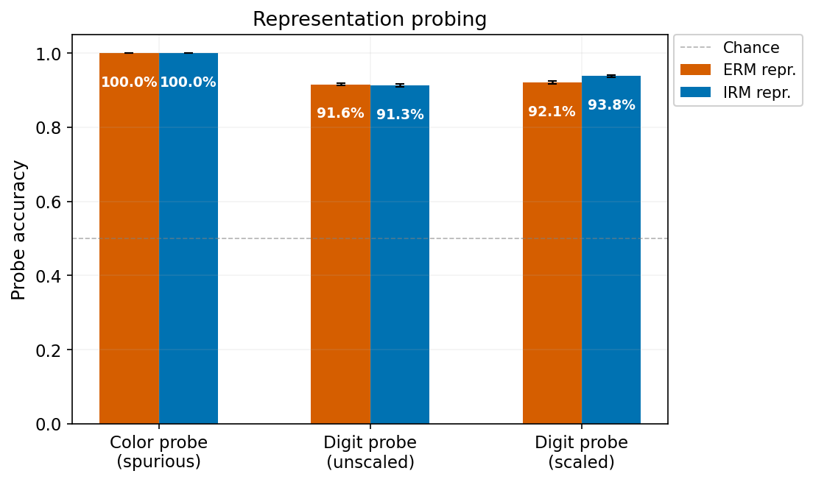
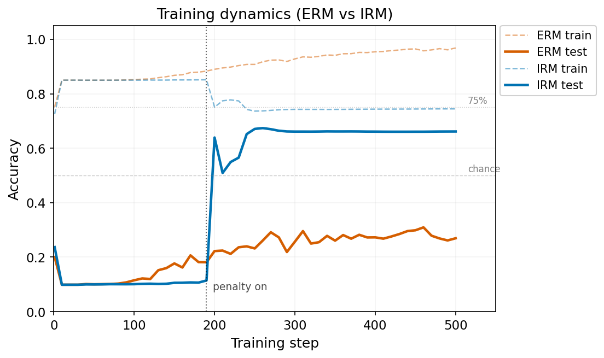

<div align="center">

# Invariant Risk Minimization on Colored MNIST

> *An empirical reproduction of [Invariant Risk Minimization (IRM)](https://arxiv.org/abs/1907.02893) and representation analysis of out-of-distribution generalization.*

[](https://colab.research.google.com/drive/12_yHp6XynY7E3vlwdlTnastwfLiklRNY?usp=sharing)

</div>

---

<div align="center">

  

  **Figure 1:** ERM memorizes the spurious color shortcut and collapses to $29.4\%$ test accuracy. IRM recovers to $66.2\%$ by penalizing features that shift across environments.
</div>

## 1. Introduction

This repository reproduces the [Colored MNIST](https://arxiv.org/abs/1907.02893) experiments from [Arjovsky et al. (2019)](https://arxiv.org/abs/1907.02893) and extends them with a linear probing analysis of the learned representations. Colored MNIST is a synthetic benchmark for out-of-distribution generalization: a spurious color feature is injected into each digit, strongly correlated with the label at training time and anti-correlated at test time. Empirical Risk Minimization (ERM) exploits this shortcut and fails under the shift; Invariant Risk Minimization (IRM) instead recovers the underlying causal (shape) feature.

## 2. Key Results

- ERM fits both training environments almost perfectly ($>96\%$) but collapses to $29.4\%$ test accuracy once the color–label correlation reverses.
- IRM trades training accuracy (down to $\sim73\%$) for robustness, reaching $66.2\%$ OOD accuracy, closely matching the original paper.
- A linear probe still recovers color from IRM's representation at $100\%$ accuracy. IRM doesn't remove the spurious feature, it teaches the classifier to ignore it.

## 3. Dataset

Binary MNIST (digits $0$–$4$: class $0$, digits $5$–$9$: class $1$) with $25\%$ label noise. Each digit is colored red or green, and color correlates with the noisy label at a different strength per environment:

<div align="center" markdown="1">

| Environment | Samples | Color–Label Correlation |
| --- | --- | --- |
| $Env_{tr_1} \; (\text{train})$ | $25,000$ | $90.1\%$ |
| $Env_{tr_2} \; (\text{train})$ | $25,000$ | $79.9\%$ |
| $Env_{test} \; (\text{test})$ | $10,000$ | $9.9\% \; (\text{reversed})$ |

</div>

<div align="center">

  

  **Figure 2:** Sample environments demonstrating the varying color-label correlation.
</div>

The $25\%$ label noise caps the Bayes-optimal accuracy at $75\%$, even for a classifier that uses shape alone. This keeps the task non-trivial: without noise, a shape-based classifier would dominate color outright, and the shortcut would never tempt the optimizer in the first place.

## 4. Architecture

A 2-hidden-layer MLP ($390$ units, ReLU), matching the original IRM paper. Input is a 2-channel $14 \times 14$ image (downsampled MNIST, one channel per color); output is a single logit for binary classification. The network is split into an `encoder` (hidden layers) and a `head` (final linear layer), so frozen encoder features can be extracted for probing.

## 5. Experiments

Both methods are trained over $3$ random seeds. Tables report mean $\pm$ standard deviation.

### 5.1 OOD Generalization

**ERM** pools all training data and minimizes cross-entropy. It has no notion of which features are spurious, it just follows the strongest gradient signal, which happens to be color.

**IRM** adds a per-environment penalty: for each environment, check whether scaling the logits by a fixed dummy scalar $w = 1.0$ is already optimal. A non-zero gradient of the loss w.r.t. $w$ means the optimal classifier differs across environments, i.e. the representation still encodes something environment-specific. Penalizing the squared norm of this gradient pushes the model toward features for which a single classifier is optimal everywhere. The penalty is switched on after a $190$-step ERM warmup.

<div align="center" markdown="1">

| Method | $Env_1$ | $Env_2$ | Test |
| --- | --- | --- | --- |
| **ERM** | $97.6\% \pm 0.4\%$ | $96.1\% \pm 0.3\%$ | **$29.4\% \pm 1.8\%$** |
| **IRM** | $73.0\% \pm 1.2\%$ | $72.8\% \pm 1.1\%$ | **$66.2\% \pm 0.1\%$** |

</div>

### 5.2 Representation Analysis

We extract the $390$-dim encoder features from both trained models and fit logistic regression probes to recover either the spurious feature (color) or the causal feature (digit class).

<div align="center" markdown="1">

| Probe Target | ERM Features | IRM Features |
| --- | --- | --- |
| **Color** (spurious) | $100.0\% \pm 0.0\%$ | $100.0\% \pm 0.0\%$ |
| **Digit** (causal) | $85.6\% \pm 0.3\%$ | $74.3\% \pm 0.1\%$ |

</div>

<div align="center">

  

  **Figure 3:** Representation probing results for ERM and IRM features.
</div>

The digit probe on IRM features ($74.3\%$) tracks IRM's actual test accuracy closely, consistent with a representation that retains mostly causal information. ERM's digit probe is higher ($85.6\%$) because its representation packs in everything, color and shape alike, it simply relies on the wrong one at test time. Color remains linearly decodable from both representations at $100\%$, so IRM's gain in robustness comes from how the head uses the representation, not from erasing color from it.

### 5.3 Training Dynamics

<div align="center" markdown="1">

  

  **Figure 4:** Training dynamics of ERM and IRM showing the effect of the invariance penalty.
</div>

The phase transition at step $190$ is the most informative part of this experiment. Before it, IRM behaves identically to ERM: both latch onto color and test accuracy drifts down. The moment the penalty switches on, test accuracy reverses and climbs while training accuracy drops. This is the trade-off in action, the model gives up a feature that helps in-distribution for one that generalizes.

## 6. Discussion

- **IRM stability:** IRM-v1 was stable here (test std $= 0.1\%$), which isn't guaranteed in general. [Gulrajani & Lopez-Paz (2021)](https://arxiv.org/abs/2007.01434) show IRM can be highly sensitive to hyperparameters on harder benchmarks like DomainBed; the simplicity of Colored MNIST likely explains the stability observed here.
- **Gap to the noise ceiling:** IRM reaches $66.2\%$ against the $75\%$ ceiling set by label noise. The gap likely comes from the interaction between the noise and IRM's optimization dynamics, longer training, LR tuning, or a stronger penalty weight are the obvious next things to try.
- **Scope:** These results are limited to Colored MNIST with a single MLP architecture and default hyperparameters. The conclusions on OOD generalization and representation entanglement are consistent with the original IRM paper, though evaluating on harder, higher-dimensional benchmarks such as DomainBed is also a plausible extension.

## 7. Usage

### 7.1 Installation

```bash
git clone https://github.com/ahmadrazacdx/colored-mnist-irm.git
cd colored-mnist-irm
pip install -r requirements.txt
```

### 7.2 Dataset Generation

```bash
python data.py
```

### 7.3 Training

`train.py` trains either method and accepts the following flags:

<div align="center" markdown="1">

| Flag | Requirement | Description | Default |
| --- | --- | --- | --- |
| `--mode` | `required` | Algorithm to use. Choices: `erm` or `irm`. | - |
| `--steps` | `optional` | Total number of training steps. | `500` |
| `--lr` | `optional` | Learning rate. | `1e-3` |
| `--penalty_weight` | `optional` | IRM penalty weight. | `1e4` |
| `--anneal_steps` | `optional` | Warmup steps before applying the IRM penalty. | `190` |

</div>

```bash
# Train using Empirical Risk Minimization (ERM)
python train.py --mode erm

# Train using Invariant Risk Minimization (IRM)
python train.py --mode irm
```

### 7.4 Probing

Extracts frozen encoder features from the trained models and fits logistic regression probes to classify the causal or spurious feature.

```bash
python probe.py
```

## 8. References

- Arjovsky, M., Bottou, L., Gulrajani, I., & Lopez-Paz, D. (2019). *Invariant Risk Minimization.* [arXiv:1907.02893](https://arxiv.org/abs/1907.02893)
- Gulrajani, I., & Lopez-Paz, D. (2021). *In Search of Lost Domain Generalization.* ICLR 2021. [arXiv:2007.01434](https://arxiv.org/abs/2007.01434)
